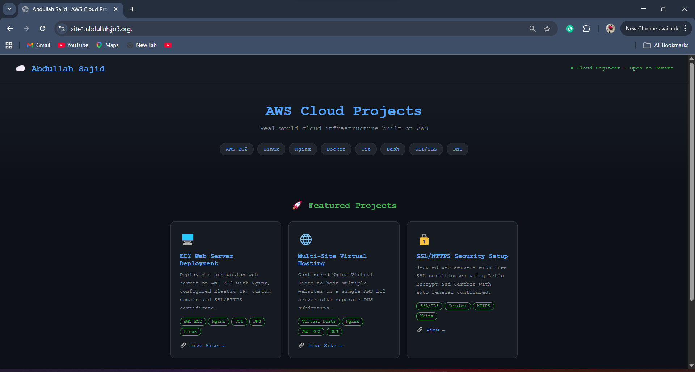
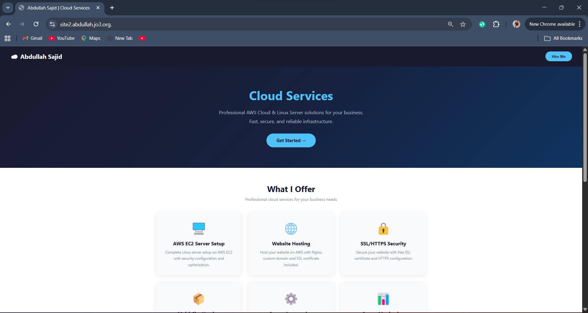

# AWS Nginx Multi Website Hosting Project ☁️

This project demonstrates how to host multiple websites on a single AWS EC2 server using Nginx virtual hosts.

## 🔧 Technologies Used
- AWS EC2 (Ubuntu Server)
- Nginx Web Server
- Linux Commands
- HTML5 & CSS3
- Domain & DNS Configuration

## 🌐 Live Websites
Website 1: 
https://site1.abdullah.jo3.org.

Website 2: 
https://site2.abdullah.jo3.org.

## 🎯 What This Project Demonstrates
- Launching and configuring an AWS EC2 instance
- Installing and configuring Nginx
- Setting up multiple server blocks (virtual hosts)
- Connecting domains with DNS records
- Hosting multiple live websites on one server

## 📚 Key Learning Outcomes
✔ Real world cloud deployment  
✔ Linux server management  
✔ Nginx configuration  
✔ Domain & DNS setup  
✔ Production level hosting basics  

## 📸 Screenshots

### Site 1 — AWS Projects

### Site 2 — Cloud Services

## 👨‍💻 Author
Abdullah Sajid – Cloud Engineer
